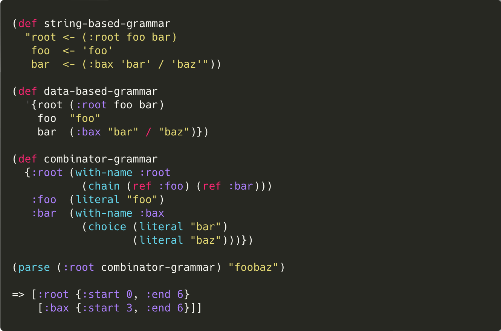

[](https://clojars.org/nl.functionalbytes/crustimoney)
[](https://cljdoc.org/d/nl.functionalbytes/crustimoney/CURRENT)
[](https://github.com/aroemers/crustimoney/actions/workflows/build.yml)
[](https://github.com/aroemers/crustimoney/releases)
<!-- [](https://clojars.org/nl.functionalbytes/crustimoney) -->
<!-- [](https://functionalbytes.nl/clojure/crustimoney/2023/03/03/crustimoney20.html) -->

# 📙 crustimoney

A Clojure library for PEG parsing, supporting various grammars, packrat caching and cuts.



## Motivation

The first version of crustimoney was my first library in Clojure, a long time ago.
Simply put, this version is the mental excercise of making it better.
I like to think it turned out well.
Maybe you like it too.


> "What does Crustimoney Proseedcake mean?" said Pooh. "For I am a Bear of Very Little
> Brain, and long words Bother me."
>
> "It means the Thing to Do."
>
> "As long as it means that, I don't mind," said Pooh humbly.

Let's parse those long words from Owl.

## Features

- Create parsers from **combinator** functions
- .. or from **string-based** definitions
- .. or from **data-driven** definitions
- Packrat **caching**, optimizing cpu usage
- Concept of **cuts**, optimizing memory usage - and error messages
- Focus on capture groups, resulting in **lean parse trees**, less coupled to grammar structure
- **Minimal parse tree** data, fetch only whats needed at post-processing
- Virtual stack, preventing overflows
- Infinite **loop detection** (runtime)
- Missing rule references detection (compile time)

## Add to project

First, add this library to your dependencies.
The instructions for the latest version can be found here: [](https://clojars.org/nl.functionalbytes/crustimoney)

## The combinators

The combinators are at the heart of the library.
Even if you decide to never use them directly, it is a good starting point.
Below is a list of available combinators.

The essentials:

- `literal`, match an exact literal string
- `chain`, chain multiple consecutive parsers
- `choice`, match the first successful parsers
- `repeat*`, eagerly match a parser as many times as possible
- `negate`, succeed if the given parser does not

Those are actually enough for parsing any unambiguous text.
But more combinators are provided, for ease of use, nicer result trees and better performance:

- `regex`, match a regular expression
- `repeat+`, same as `repeat*`, but require at least one match
- `lookahead`, succeed if the given parser does, without advancing
- `maybe`, try the given parser, succeed anyway
- `eof`, succeed if there is no more input

Each combinator returns a parser.
Some combinators take one or more parsers, making them composable.
Such a parser can be supplied to `core/parse`, together with the string to parse.

## Parse results

The result is a "hiccup"-style parse tree, for example:

```clj
[:node {:start 0, :end 6}
 [:child-node {:start 0, :end 3}]
 [:child-node {:start 3, :end 6}]]
```

To capture a node during parsing, it must be "named", such as `:node` or `:child-node` in above example.
This is done by wrapping a parser with `combinators/with-name` (or by other means, depending on the grammar type).
Results without a name are filtered out, though its named children are kept.
The root node can be nameless (`nil`).

On unsuccessful parses, a set of errors is returned, which has the following structure:

```clj
#{{:key :expected-literal, :at 10, :detail {:literal "foo"}}
  {:key :expected-match, :at 8, :detail {:regex "alice|bob"}}
  {:key :unexpected-match, :at 8, :detail {:text "eve"}}}
```

If you want to override the default key of an error, a parser can be wrapped with `combinators/with-error`.
For example:

```clj
(def parser
  (with-error :number-required
    (regex #"\d+")))

(core/parse parser "nan")
=> #{{:key :number-required, :at 0}}
```

To work with these successes and errors, the functions in the `results` namespace can be used.
These allow you to get the text of a success node for example, or add `:line` and `:column` keys to the errors.

## Recursive grammars

Composing a single parser can be enough in some cases.
More complex texts need or are better expressed with a recursive grammar, i.e. named parsers that can refer to each other.
For this the `grammar` macro and `ref` function is used.
For example:

```clj
(def my-grammar
  (grammar
   {:root (repeat+ (choice (ref :foo) (ref :bax)))
    :foo  (literal "foo")
    :bax  (regex "ba(r|z)")}))
```

This will return a normal map, where the refs have been bound to the rules in the grammar.
The macro will ensure that all references resolve correctly.
This grammar can be used as follows:

```clj
(core/parse (:root my-grammar) "foobaz")
=> [nil {:start 0, :end 6}]
```

## Auto-named rules

The example above shows that all success nodes are filtered out, except the root node, as they are nameless.
The parsers could be wrapped with `with-name`, but the names can be the same as the grammar rule names in this case.
Appending an `=` to the rule name will automatically wrap the parser as such.
This would update the grammar to:

```clj
(grammar
 {:root= (repeat+ (choice (ref :foo) (ref :bax)))
  :foo=  (literal "foo")
  :bax=  (regex "ba(r|z)")})
```

Note that the `ref` keys are still without the postfix.
Parsing it again would yield the following result:

```clj
[:root {:start 0, :end 6}
 [:foo {:start 0, :end 3}]
 [:bax {:start 3, :end 6}]]
```

A word of caution though.
It is encouraged to be very intentional about which nodes should be captured and when.
For example, using the following grammar would _only_ yield a `:wrapped` node if the `:expr` is really wrapped in parentheses:

```clj
{:wrapped (choice (with-name :wrapped
                    (chain (literal "(")
                           (ref :expr)
                           (literal ")")))
                  (ref :expr))
 :expr=   ...}
```

This approach results in shallower result trees and thus less post-processing.

## Cuts

Most PEG parsers share a downside: they are memory hungry.
This is due to their packrat caching, that provides one of their upsides: linear parsing time.

[This paper](https://www.researchgate.net/publication/221292729_Packrat_parsers_can_handle_practical_grammars_in_mostly_constant_space) describes adding _cuts_ to PEGs, a concept that is known from Prolog.
Crustimoney expands on this by differentiating between _hard_ cuts and _soft_ cuts.

### Hard cuts

A hard cut tells the parser that it should never backtrack beyond the position where it encountered a hard cut.
This has two major benefits.
The first is better and more localized error messages.
The following example shows this, and also how to add a hard cut in the `chain` combinator.

```clj
(def example
  (maybe (chain (literal "(")
                :hard-cut
                (regex #"\d+")
                (literal ")"))))

(core/parse example "(42")
=> #{{:key :expected-literal, :at 3, :detail {:literal ")"}}}
```

Without the hard cut, the parse would be successful (because of the `maybe` combinator).
But, since the text clearly opens a bracket, it would be better to fail.
The hard cut enforces this, as the missing `")"` error cannot backtrack beyond it.
So from a user's standpoint, a cut can already very beneficial.

The second major benefit is that the parser can release everything in its cache before the cut position.
It will never need this again.
This behaviour makes that well placed hard cuts - especially when parsing repeating structures - can alleviate the memory requirements to be constant.

Note that a cut can only be used within a `chain`, and never as the first element.
The preceding parser(s) should consume some input, and that input should only be valid for that chain of parser(s) at that point.

### Soft cuts

There are situations that localized error messages are desired, but backtracking should still be possible.
For such situations a soft cut can be used.
Such a cut also disallows backtracking, but only while inside the `chain`.
Once the chain is successfully parsed, the soft cut has no effect anymore.

Consider the expansion of the previous example:

```clj
(def example
  (choice (chain
            ;; --- same as before, but now with soft-cut
            (maybe (chain (literal "(")
                          :soft-cut
                          (regex #"\d+")
                          (literal ")")))
            ;; ---
            (literal "foo"))
          (literal "bar")))

(core/parse example "(42")
=> #{{:key :expected-literal, :at 3, :detail {:literal ")"}}}

(core/parse example) "(42)baz")
=> #{{:key :expected-literal, :at 4, :detail {:literal "foo"}}
     {:key :expected-literal, :at 0, :detail {:literal "bar"}}}
```

The `:hard-cut` has been replaced with a `:soft-cut`.
As shown, this still shows a localized error for the missing `")"`, yet it also allows backtracking to try the `"bar"` choice.

Since backtracking before the soft cut is still allowed outside of the chain's scope, the cache is not affected.
However, soft and hard cuts can be combined in a grammar.
We could for instance extend the grammar a bit more:

```clj
(repeat+ (chain example :hard-cut))
```

This effectively says that after each finished `example`, we won't backtrack, that part is done.
Many of such consecutive `example`s can be parsed, without memory requirements growing (except for the growing parse result tree).

The significance of cuts in PEGs must not be underestimated.
Try to use them in your grammar on somewhat larger inputs.
The overhead is small, and is actually countered by faster cache lookups.

## String-based grammar

A parser or grammar can be defined in a string.
While direct combinators have the most flexibility, a string-based definition is far denser.
The discussed combinators translate to this string-based grammar in the following way:

```
literal   <- 'foo'
chain     <- 'foo' 'bar'
choice    <- 'bar' / 'baz'

repeat*   <- 'foo'*
repeat+   <- 'foo'+
maybe     <- 'foo'?

negate    <- !'foo'
lookahead <- &'foo'

regex     <- #'ba(r|z)'
chars     <- [a-zA-Z]*

eof       <- $
ref       <- literal

group     <- ('foo' 'bar' / 'alice')
named     <- (:bax regex)

soft-cut  <- >
hard-cut  <- >>
```

The function `string-grammar/create-parser` is used to create a parser out of such a string.
Note that above "example" has rules and thus describes a recursive grammar.
Therefore a map is returned by `create-parser`.
However, it is perfectly valid to define a single parser, such as:

```
'alice and ' !'eve' [a-z]+
```

A second argument can be passed to `create-parser`, which is a map of other parsers that can be used by the grammar.
For example:

```clj
(create-parser "root <- 'Hello ' email"
               {:email (regex "...")})
```

The names of the rules can have an `=` sign appended, for the auto-named feature discussed earlier.

Note (for the purists) that the `.` (dot, match any non-newline char) and `ε` (epsilon, match the empty string) from the original PEG paper are missing.
This is on purpose.
The other available constructs, such as regular expression support, have far better performance characteristics and nicer result trees.

## Data-based grammar

Next to the string-based definition, there is also a data-driven variant available.
The grammar below shows how such a definition is formed.
It is very similar to the string-based grammar.

```clj
'{literal    "foo"
  character  \f
  regex      #"ba(r|z)"
  regex-tag  #crusti/regex "ba(r|z)" ; EDN support

  chain      ("foo" "bar")
  choice     ("bar" / "baz")

  repeat*    ("foo"*)
  repeat+    ("foo"+)
  maybe      ("foo"?)

  negate     (!"foo")
  lookahead  (&"foo")

  eof        $
  ref        literal

  group      ("foo" "bar" / "alice")
  named      (:bax regex)

  soft-cut   >
  hard-cut   >>

  combinator-call   [:with-error :fail #crusti/parser ("fooba" #"r|z")]
  custom-combinator [:my.app/my-combinator ...]}
```

The function `data-grammar/create-parser` is used to create a parser out of such a definition.

The data-based definition shares many properties with the string-based one.
It works the same way in supporting both recursive and non-recursive parsers, it also has auto-naming (the `=` postfix), and it can take an extra map of predefined parsers as well.

It does have an extra feature: direct combinator calls, using vectors.
The first keyword in the vector determines the combinator.
If it is without a namespace, `crustimoney.combinators` is assumed.
The other arguments are left as-is, except those tagged with `#crusti/parser`.
With that tag, the data is processed again as a parser definition.

### EDN support

Since the grammar definition is data, it is perfectly feasible to use the EDN format.
The `#crusti/...` tags are not automatically supported by Clojure's EDN reader.
The following code makes it work:

```clj
(clojure.edn/read-string {:readers *data-readers*} ...)
```

Note that regular expressions are not supported in plain EDN.
For this you can use the `#crusti/regex` tag (see above example), although it could also be written as `[:regex ".."]`.

## Vector-based grammar

The former section on data-based grammars describes that a vector is a valid data type, and that these translate to combinator calls.
That means that it is possible to write the entire grammar using vectors.
Thing is, _this is actually what both the string-based and data-based parser generators do_.
Both generators use it as an intermediary format, and use `vector-grammar/create-parser` to actually turn it into combinators calls.
While it is not intended for direct use, this approach has some benefits.

One benefit of this is that the generators output can be debugged.
To see what combinator tree would be formed by a string- or data-based definition, you can call `string-grammar/vector-tree` or `data-grammar/vector-tree`.
This will show the entire combinator tree in vector format.

Another benefit is that the data-grammar can easily be extended.
The function `data-grammar/vector-tree` is actually a protocol function.
This makes it possible to add support for other data types, using Clojure's `extend-type`.
The implementation simply returns a vector, possibly pointing to your own combinator (see further down below).

## Built-in parsers

The library provides a couple of predefined parsers in the `built-ins` namespace, for parsing things like spaces, numbers, words and strings.
It also contains a map called `all`, containing all of the built-in parsers.
This map can be used as a basis for your own grammar, by passing it along to `grammar` or the `create-parser` functions.

```clj
(string-grammar/create-parser
 "root <- (space? (:name word) blank (:id natural) space?)* $"
 built-ins/all))
```

## Writing your own combinator

A parser combinator returns a function that takes a text input and a position.
It returns either a success or (a set of) errors.
It does this using the `results` namespace, which has functions like `->success` and `->error`.
Some combinators take other parser functions as their argument, making them composeable.

However, the parsers returned by the combinators do not call other parsers directly.
This could lead to stack overflows.
So next to a `->success` or `->error` result, it can also return a `->push` result.
This pushes another parser onto a virtual stack, together with an index and possibly some state.

For this reason, a parser function has the following signature:

```clj
(fn
  ([text index]
    ...)
  ([text index result state]
   ...))
```

The 2-arity variant is called when the parser was pushed onto the stack.
It receives the entire text and the index it should begin parsing.

If it returns a "push" result, the 4-arity variant is called when that parser is done.
It receives the text and the original index, but also the result of the pushed parser and any state that was pushed with it.
Now it can decide whether to return a success, a set of errors, or again a push.

Before you write your own combinator, do realise that the provided combinators are complete in the sense that they can parse any structured text.

## Experimental combinators

Lastly, there are a couple of experimental combinators.
Being experimental, they may get promoted, or changed, or dismissed.

- `range`, like a `repeat`, requiring at least a minimum of matches and stops after a maximum of matches
- `stream`, like `repeat*`, pushing each match result to a callback
- `recover`, like a `choice`, capturing errors of the first choice, including soft-cuts

These can be found in the `combinators.experimental` namespace, including more documentation on them.

_That's it. As always, have fun!_ 🚀

## License

Copyright © 2022-2023 Arnout Roemers

This program and the accompanying materials are made available under the
terms of the Eclipse Public License 2.0 which is available at
http://www.eclipse.org/legal/epl-2.0.

This Source Code may also be made available under the following Secondary
Licenses when the conditions for such availability set forth in the Eclipse
Public License, v. 2.0 are satisfied: GNU General Public License as published by
the Free Software Foundation, either version 2 of the License, or (at your
option) any later version, with the GNU Classpath Exception which is available
at https://www.gnu.org/software/classpath/license.html.
